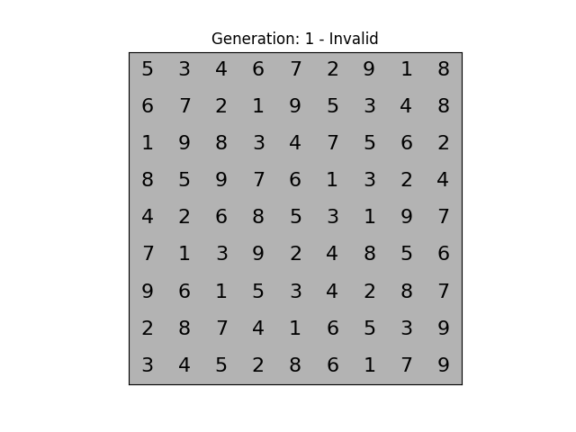

# Sudoku Optimizer

This project implements an optimization algorithm for solving Sudoku puzzles. The Sudoku optimizer aims to provide an efficient way to solve Sudoku grids using various optimization techniques.

Ez a projekt egy optimalizálási algoritmust valósít meg a Sudoku rejtvények megoldására. A Sudoku optimalizáló célja, hogy hatékony módot biztosítson a Sudoku rácsok megoldására különböző optimalizálási technikák segítségével.

---

## Project Structure / Projekt Struktúra

```
sudoku-optimizer
├── soduko_solver.py
├── requirements.txt
└── README.md
```

- **`soduko_solver.py`**: Contains the implementation of the genetic algorithm for solving Sudoku puzzles.
  - Tartalmazza a genetikus algoritmus implementációját a Sudoku rejtvények megoldására.
- **`requirements.txt`**: Lists the required Python packages for the project.
  - A projekthez szükséges Python-csomagokat tartalmazza.
- **`README.md`**: Documentation for the project.
  - A projekt dokumentációja.

---

## Installation / Telepítés

To install the required dependencies, run:
A szükséges függőségek telepítéséhez futtasd az alábbi parancsot:

```
pip install -r requirements.txt
```

---

## Usage / Használat

To solve a Sudoku puzzle, you can use the `SudokuGeneticSolver` class from the `soduko_solver.py` file. Here is a basic example:
Egy Sudoku rejtvény megoldásához használd a `SudokuGeneticSolver` osztályt a `soduko_solver.py` fájlból. Íme egy alapvető példa:

```python
from soduko_solver import SudokuGeneticSolver

grid = [
    [0, 3, 4, 6, 7, 8, 9, 1, 0],
    [6, 0, 2, 1, 0, 5, 3, 0, 8],
    [1, 9, 0, 3, 4, 2, 0, 6, 7],
    [8, 5, 9, 0, 6, 0, 4, 2, 3],
    [0, 2, 0, 8, 0, 3, 0, 9, 0],
    [7, 1, 3, 0, 2, 0, 8, 5, 6],
    [9, 6, 0, 5, 0, 7, 0, 8, 4],
    [2, 0, 7, 4, 1, 9, 6, 0, 5],
    [0, 4, 5, 2, 0, 6, 1, 7, 0]
]

solver = SudokuGeneticSolver(grid)
solution, generation_found = solver.solve_with_visualization()

if solution is not None:
    print("Sudoku solved!")
    print(np.array(solution))
    print(f"Solution found at generation: {generation_found}")
else:
    print("No solution found.")
```

---

## Visualization / Vizualizáció

The project includes a visualization of the Sudoku solving process. The solution steps are saved as a GIF file named `sudoku_solution.gif`.

A projekt tartalmaz egy vizualizációt a Sudoku megoldási folyamatáról. A megoldás lépései egy `sudoku_solution.gif` nevű GIF fájlba kerülnek mentésre.

### Example / Példa

Below is an example of the generated GIF:
Az alábbiakban egy példa a generált GIF-re:



---

## Running Tests / Tesztek futtatása

To run the tests for the project, use the following command:
A projekt tesztjeinek futtatásához használd az alábbi parancsot:

```
pytest
```

This will execute all unit tests defined in the `tests` directory.
Ez végrehajtja az összes tesztet, amely a `tests` könyvtárban van definiálva.

---

## Contributing / Hozzájárulás

Contributions are welcome! Please feel free to submit a pull request or open an issue for any suggestions or improvements.

Hozzájárulásokat szívesen fogadok! Nyugodtan küldj pull requestet, vagy nyiss egy hibajegyet bármilyen javaslat vagy fejlesztés esetén.