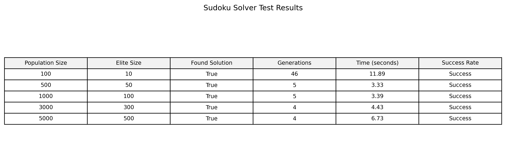

# Sudoku Optimalizáló

Ez a projekt egy genetikus algoritmust implementál a Sudoku rejtvények megoldására. Az algoritmus evolúciós technikákat használ különböző nehézségű Sudoku rácsok megoldására.

---

## Projekt Struktúra

```
sudoku-optimizer
├── soduko_solver.py
├── sudoku_tester.py
├── grids.txt
└── README.md
```

- **`soduko_solver.py`**: Tartalmazza a genetikus algoritmus implementációját vizualizációs funkciókkal.
- **`sudoku_tester.py`**: Tesztelési és teljesítmény-elemzési funkciókat tartalmaz.
- **`grids.txt`**: Különböző nehézségű Sudoku rácsok gyűjteménye (2-60 üres cellával).
- **`README.md`**: A projekt dokumentációja.

---

## Jellemzők

- Genetikus algoritmus implementáció
- A megoldási folyamat vizuális megjelenítése
- Különböző nehézségi szintek támogatása
- Folyamat vizualizáció matplotlib segítségével
- Megoldás animáció mentése GIF formátumban
- Teljesítmény tesztelés és összehasonlítás

---

## Követelmények

- Python 3.x
- numpy
- matplotlib
- IPython

---

## Használat

Egy Sudoku rejtvény megoldásához használd a `SudokuGeneticSolver` osztályt a `soduko_solver.py` fájlból:

```python
from soduko_solver import SudokuGeneticSolver
import numpy as np

# Példa rács 60 üres cellával (nehéz)
racs = [
    [9, 0, 0, 0, 8, 0, 0, 0, 0],
    [0, 3, 0, 0, 0, 5, 0, 0, 9],
    [0, 0, 0, 3, 9, 0, 0, 7, 0],
    [0, 0, 0, 7, 0, 0, 0, 0, 0],
    [0, 0, 0, 0, 3, 1, 0, 0, 6],
    [7, 0, 0, 6, 0, 0, 0, 0, 0],
    [0, 0, 0, 0, 0, 7, 3, 0, 2],
    [0, 0, 0, 0, 0, 0, 1, 0, 7],
    [0, 7, 0, 0, 0, 9, 0, 0, 0]
]

megoldo = SudokuGeneticSolver(racs)
megoldas, generacio = megoldo.solve_with_visualization()

if megoldas is not None:
    print("Sudoku megoldva!")
    print(np.array(megoldas))
    print(f"Megoldva {generacio} generáció alatt.")
else:
    print("Nem található megoldás.")
```

---

## Vizualizáció

A projekt két különböző típusú vizualizációt tartalmaz:

### 1. Solver Vizualizáció (`soduko_solver.py`)
- **Megoldási folyamat animáció**
  - Mentve `sudoku_solution.gif` néven
  - Mutatja a legjobb megoldás evolúcióját minden generációban
- **Fitness történet grafikon**
  - A fitness értékek változása a generációk során
- **Összehasonlító kép**
  - Kezdő és végállapot összehasonlítása
  - Eredeti számok és a megoldás vizuális összevetése

### 2. Teszt Vizualizáció (`sudoku_tester.py`)
- **Teljesítmény táblázat**
  - Különböző populáció méretekkel futtatott tesztek eredményei
  - PNG formátumban mentve (`sudoku_test_results.png`)
  - Tartalmazza:
    - Populáció méreteket
    - Elit méretet
    - Megoldás sikerességét
    - Generációk számát
    - Futási időt
    - Sikerességi rátát

### Példa Kimenetek

1. **Megoldási Folyamat**
   

2. **Teljesítmény Összehasonlítás**
   

---

## Paraméterek

A genetikus algoritmus az alábbi paraméterekkel hangolható:

- `population_size`: Populáció mérete (alapértelmezett: 2000)
- `generations`: Maximális generációk száma (alapértelmezett: 5000)
- `mutation_rate`: Mutáció valószínűsége (alapértelmezett: 0.4)
- `elite_size`: Megőrzendő legjobb megoldások száma (populáció 5%-a)

---

## Algoritmus Részletek

A genetikus algoritmus a következő főbb lépéseket követi:

### Pszeudokód

```
Inicializálás:
    Timer indítása
    Populáció méret = 3000
    Generációk száma = 5000
    Mutációs ráta = 0.3
    Elit méret = populáció_méret * 0.1
    Stagnálás számláló = 0
    Legjobb fitness = végtelen

Populáció Inicializálása:
    Minden egyedre a populációban:
        Grid másolása
        Minden sorra:
            Hiányzó számok összegyűjtése (1-9 közül)
            Számok véletlenszerű keverése
            Üres cellák feltöltése a kevert számokkal

Amíg generációk < max_generációk:
    Fitness Számítás:
        Minden egyedre:
            Fitness = 0
            Minden sorra:
                Fitness += (9 - egyedi_számok_száma)
            Minden oszlopra:
                Fitness += (9 - egyedi_számok_száma)
            Minden 3x3 blokkra:
                Fitness += (9 - egyedi_számok_száma)

    Aktuális legjobb fitness kiírása
    
    Stagnálás Ellenőrzése:
        Ha aktuális_legjobb >= legjobb_fitness:
            Stagnálás_számláló++
        Egyébként:
            Legjobb_fitness = aktuális_legjobb
            Stagnálás_számláló = 0
        
        Ha stagnálás_számláló > 100:
            Populáció újraindítása
            Következő generációra ugrás

    Ha van 0 fitness:
        Timer leállítása
        Futási idő kiírása
        Megoldás vizualizálása
        Return (megoldás, generáció_szám)

    Új Generáció Létrehozása:
        Elit egyedek kiválasztása (legjobb 10%)
        Tournament selection (5-ös méretű tornák)
        Amíg új_populáció < populáció_méret:
            Két szülő véletlenszerű kiválasztása
            Többpontos keresztezés (2-4 pont)
            Ha random < mutációs_ráta:
                Mutáció:
                    Minden sorra:
                        Ha random < mutációs_ráta:
                            Ha random < 0.3:
                                Teljes sor újrakeverése
                            Egyébként:
                                2-n véletlenszerű csere a sorban
                                (n = üres cellák száma)
            Új egyed hozzáadása a populációhoz

    Legjobb megoldás mentése vizualizációhoz

Ha nem talált megoldást:
    Timer leállítása
    Futási idő kiírása
    Return (None, None)
```

### Főbb Komponensek

1. **Populáció Inicializálás**
   - Grid másolása és üres cellák feltöltése
   - Soronként véletlenszerű érvényes számok generálása
   - Eredeti számok megőrzése

2. **Fitness Számítás**
   - Sorok, oszlopok és blokkok duplikátumainak számolása
   - Tökéletes megoldás esetén fitness = 0
   - Magasabb érték = több duplikátum

3. **Stagnálás Kezelése**
   - 100 generáció után újraindítás ha nincs javulás
   - Legjobb fitness érték követése
   - Populáció újrainicializálása szükség esetén

4. **Új Generáció**
   - Elit egyedek megőrzése (10%)
   - Tournament selection szülők kiválasztásához
   - Többpontos keresztezés
   - Kétféle mutációs stratégia

5. **Időmérés és Vizualizáció**
   - Futási idő mérése
   - Generációk számának követése
   - Megoldási folyamat vizualizálása

---

## Teljesítmény Jellemzők

### Erőforrás Használat
- **CPU**: Intenzív számítási műveletek a genetikus algoritmusban
- **Memória**: 
  - Populáció tárolása (N * 9 * 9 méretű tömbök)
  - Fitness történet és megoldások tárolása
  - Vizualizációs adatok

### Futási Idő
- Függ a következőktől:
  - Populáció méret
  - Üres cellák száma
  - Generációk maximális száma
  - CPU teljesítmény

### Skálázhatóság
- Nagyobb populáció = pontosabb megoldás, hosszabb futási idő
- Több generáció = nagyobb esély a megoldásra
- Magasabb elit arány = stabilabb konvergencia

---

## Ismert Korlátozások
- Nagyon nehéz Sudoku rejtvényeknél (>60 üres cella) a megoldás nem garantált
- A futási idő exponenciálisan nőhet az üres cellák számával
- Nagy memóriaigény nagy populációméretnél

---

## Tippek a Használathoz
- Kezdje kisebb populációmérettel (1000-3000)
- Állítsa be a generációk számát a rejtvény nehézségének megfelelően
- Használja a vizualizációt a konvergencia megfigyeléséhez
- Nehezebb rejtvényeknél növelje az elit arányt

---

## Hozzájárulás

Nyugodtan küldj hibajegyeket és fejlesztési javaslatokat!