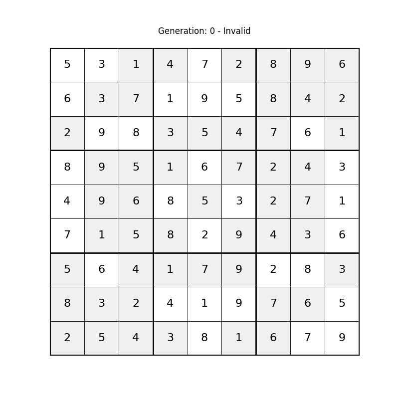

# Sudoku Optimalizáló

Ez a projekt egy genetikus algoritmust implementál a Sudoku rejtvények megoldására. Az algoritmus evolúciós technikákat használ különböző nehézségű Sudoku rácsok megoldására.

---

## Projekt Struktúra

```
sudoku-optimizer
├── soduko_solver.py
├── grids.txt
└── README.md
```

- **`soduko_solver.py`**: Tartalmazza a genetikus algoritmus implementációját vizualizációs funkciókkal.
- **`grids.txt`**: Különböző nehézségű Sudoku rácsok gyűjteménye (2-60 üres cellával).
- **`README.md`**: A projekt dokumentációja.

---

## Jellemzők

- Genetikus algoritmus implementáció
- A megoldási folyamat vizuális megjelenítése
- Különböző nehézségi szintek támogatása
- Folyamat vizualizáció matplotlib segítségével
- Megoldás animáció mentése GIF formátumban

---

## Követelmények

- Python 3.x
- numpy
- matplotlib
- IPython

---

## Használat

Egy Sudoku rejtvény megoldásához használd a `SudokuGeneticSolver` osztályt a `soduko_solver.py` fájlból:

```python
from soduko_solver import SudokuGeneticSolver
import numpy as np

# Példa rács 60 üres cellával (nehéz)
racs = [
    [9, 0, 0, 0, 8, 0, 0, 0, 0],
    [0, 3, 0, 0, 0, 5, 0, 0, 9],
    [0, 0, 0, 3, 9, 0, 0, 7, 0],
    [0, 0, 0, 7, 0, 0, 0, 0, 0],
    [0, 0, 0, 0, 3, 1, 0, 0, 6],
    [7, 0, 0, 6, 0, 0, 0, 0, 0],
    [0, 0, 0, 0, 0, 7, 3, 0, 2],
    [0, 0, 0, 0, 0, 0, 1, 0, 7],
    [0, 7, 0, 0, 0, 9, 0, 0, 0]
]

megoldo = SudokuGeneticSolver(racs)
megoldas, generacio = megoldo.solve_with_visualization()

if megoldas is not None:
    print("Sudoku megoldva!")
    print(np.array(megoldas))
    print(f"Megoldva {generacio} generáció alatt.")
else:
    print("Nem található megoldás.")
```

---

## Vizualizáció

A megoldó két típusú vizualizációt generál:

1. **Megoldási folyamat animáció**
   - Mentve `sudoku_solution.gif` néven
   - Mutatja a legjobb megoldás evolúcióját minden generációban

2. **Fitness történet grafikon**
   - Mutatja hogyan javul a megoldás minősége a generációk során

### Példa

Az alábbiakban egy példa a generált GIF-re:



---

## Paraméterek

A genetikus algoritmus az alábbi paraméterekkel hangolható:

- `population_size`: Populáció mérete (alapértelmezett: 2000)
- `generations`: Maximális generációk száma (alapértelmezett: 5000)
- `mutation_rate`: Mutáció valószínűsége (alapértelmezett: 0.4)
- `elite_size`: Megőrzendő legjobb megoldások száma (populáció 5%-a)

---

## Algoritmus Részletek

A genetikus algoritmus a következő főbb lépéseket követi:

### Pszeudokód

```
Populáció Inicializálása:
    Minden egyedre a populációban:
        Érvényes Sudoku rács létrehozása az eredeti számok megtartásával
        Üres cellák feltöltése véletlenszerű érvényes számokkal

Amíg generációk < max_generációk:
    Fitness Számítás:
        Minden egyedre:
            Sorok duplikátumainak számolása
            Oszlopok duplikátumainak számolása
            3x3-as blokkok duplikátumainak számolása
            Minden duplikátum összegzése fitness értékként
            (Alacsonyabb fitness érték jobb, 0 a tökéletes megoldás)
    
    Ha legjobb_fitness == 0:
        Megoldás megtalálva, kilépés
        
    Új Generáció Létrehozása:
        Szülők Kiválasztása:
            Legjobb megoldások megtartása (elit_méret)
            Torna szelekció a maradék helyekre
        
        Keresztezés:
            Kiválasztott szülőkre:
                Véletlenszerű keresztezési pontok választása
                Gyermek létrehozása szülők kombinálásával
        
        Mutáció:
            Minden sorra a gyermekben:
                Mutációs_ráta valószínűséggel:
                    Két véletlenszerű cella cseréje a sorban
                    (Csak az eredetileg üres cellák cserélhetők)
    
    Ha stagnálás észlelhető:
        Populáció újraindítása
```

### Főbb Komponensek

1. **Populáció Inicializálás**
   - Érvényes kezdeti rácsok létrehozása az eredeti puzzle számainak megtartásával
   - Üres cellák véletlenszerű feltöltése a sorokon belüli Sudoku szabályok betartásával

2. **Fitness Számítás**
   - Értékeli, mennyire közel van egy megoldás az érvényességhez
   - Számlálja a duplikátumokat sorokban, oszlopokban és 3x3-as blokkokban
   - A tökéletes megoldás fitness értéke 0 (nincs duplikátum)

3. **Kiválasztás**
   - Elitizmus: Megtartja a legjobb megoldásokat
   - Torna szelekció: Véletlenszerűen kiválaszt egyedeket és a legjobbat választja
   - Jobb fitness értékű egyedeknek nagyobb az esélye a kiválasztásra

4. **Keresztezés**
   - Két szülő megoldás kombinálása új megoldás létrehozásához
   - Több keresztezési pontot használ a sorok cseréjéhez
   - Megőrzi az eredeti puzzle számait

5. **Mutáció**
   - Véletlenszerűen cserél számokat a sorokon belül
   - Csak az eredetileg üres cellákat mutálja
   - Segít fenntartani a populáció változatosságát

6. **Újraindítási Mechanizmus**
   - Észleli, amikor az algoritmus elakad (stagnálás)
   - Újrainicializálja a populációt a legjobb megoldások megtartásával
   - Segít elkerülni a lokális optimumokat

A genetikus algoritmus specifikusan Sudokura adaptált az alábbiak szerint:

- Érvényes sorok fenntartása az inicializálás során
- Csak az eredetileg üres cellák módosítása
- Sororientált keresztezés a részleges megoldások megőrzésére
- Intelligens mutáció a Sudoku szabályok betartásával

---

## Hozzájárulás

Nyugodtan küldj hibajegyeket és fejlesztési javaslatokat!